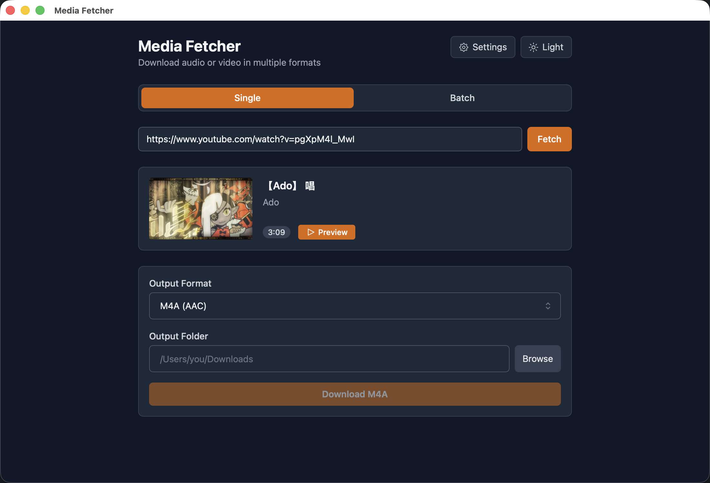

# Media Fetcher

Download audio or video from Video Platform (i.e YouTube) in multiple formats with a native desktop app, web UI, or CLI.

Built with **Tauri 2** (Rust backend) + **React + Vite** (frontend).

---

## Preview



---

## Features

- 🎵 Download audio as **mp3, m4a, wav, ogg, or flac**
- 🎬 Download video as **mp4 or webm** with selectable resolution (360p–2160p)
- 📦 **Batch download** — queue up to 20 URLs, downloads 3 at a time
- ✂️ **Visual waveform trim** — drag region handles or type start/end times
- 👁 **Audio preview** — WaveSurfer.js waveform before downloading
- 📁 **Native folder picker** — via Tauri dialog plugin
- 📋 **Live job queue** — per-download progress tracking
- ⚙️ **Persistent settings** — default format, bitrate, and output folder saved to app config
- 🌙 **Dark mode**
- 🖥 **Three modes** — Desktop app, Web UI, or CLI

---

## Installation

Download the latest release for your platform from the [Releases](https://github.com/vincy-cheng/media-fetcher/releases) page and follow the instructions in the README.

### Troubleshooting

The app is blocked by macOS Gatekeeper because it's not notarized. You may see a warning like "“Media Fetcher” is damaged and can’t be opened. You should eject the disk image.". To bypass this warning:

1. Open Terminal Ctrl + Space → type "Terminal" → Enter
2. Run `sudo xattr -d com.apple.quarantine /Applications/Media\ Fetcher.app`

**Note**: The path may be different if you moved the app to a different location. Adjust the path accordingly.

---

## Modes

### Desktop App (Tauri)

Native ~15 MB app. No browser required.

```bash
npm run dev       # dev mode (hot reload)
npm run build     # production build → src-tauri/target/release/bundle/
```

### Web UI

Browser-based. Requires Express server + Vite dev server.

```bash
npm run dev:web   # starts Express on :3001 + Vite on :5173
```

Then open `http://localhost:5173`.

> **Web UI limitations vs Desktop:** Audio preview, native folder picker, and yt-dlp self-update are not available in web mode. Output folder must be typed manually.

### CLI

```bash
# Single URL
npm run cli -- https://www.youtube.com/watch?v=XXXXXXXXXXX

# With options
npm run cli -- https://youtu.be/XXXXXXXXXXX --format mp3 --output ~/Downloads

# Trim
npm run cli -- https://youtu.be/XXXXXXXXXXX --start 0:30 --end 2:45 --format flac

# Interactive (no args — prompts for everything)
npm run cli
```

**CLI flags:**

| Flag | Description |
|---|---|
| `-f, --format` | `mp3` \| `m4a` \| `wav` \| `ogg` \| `flac` \| `mp4` \| `webm` (default: prompted) |
| `-r, --resolution` | `360p` \| `480p` \| `720p` \| `1080p` \| `1440p` \| `2160p` — video only (default: `1080p`) |
| `-s, --start` | Trim start time `HH:MM:SS` or `MM:SS` |
| `-e, --end` | Trim end time `HH:MM:SS` or `MM:SS` |
| `-o, --output` | Output directory path (default: prompted) |

---

## Requirements

### All modes
- **[yt-dlp](https://github.com/yt-dlp/yt-dlp)** — Video downloader (supported video sites refers to yt-dlp [docs](https://github.com/yt-dlp/yt-dlp/blob/master/supportedsites.md))
- **[ffmpeg](https://ffmpeg.org/)** — Audio and video conversion

Install on macOS:
```bash
brew install yt-dlp ffmpeg
```

### Desktop app (Tauri) — additional
- **Rust** toolchain: `rustup update stable`
- **Xcode license** accepted: `sudo xcodebuild -license accept`

---

## Setup

```bash
# Install all dependencies (also downloads sidecar binaries for the desktop app)
npm install
npm install --prefix client
```

`npm install` runs `scripts/download-binaries.sh` automatically via `postinstall`. It detects your platform, downloads the correct `yt-dlp` and `ffmpeg` builds, and places them in `src-tauri/binaries/` with the required Rust target triple suffix.

> **Manual sidecar setup** (if the script fails): see [Sidecar Setup](#sidecar-setup-manual).

The CLI and Web modes resolve binaries via `resolveBin()` in `src/core/downloader.ts`: checks `YTDLP_BIN`/`FFMPEG_BIN` env vars first, then falls back to the bundled sidecars in `src-tauri/binaries/`, then falls back to system `PATH`.

---

## Batch download

- Up to **20 URLs** queued (`MAX_BATCH_URLS = 20`)
- Video info fetched in parallel as URLs are added
- Downloads run with **3 concurrent workers** (`MAX_CONCURRENT_DOWNLOADS = 3`) via `runWithConcurrency` in `useBatchDownload.ts`
- Each item uses its own `jobId` (UUID) for progress tracking via Tauri events

---

## npm Scripts

| Script | Description |
|---|---|
| `npm run dev` | Tauri desktop app (dev mode) |
| `npm run build` | Tauri production build |
| `npm run dev:web` | Web mode — Express `:3001` + Vite `:5173` |
| `npm run serve` | Express server only |
| `npm run cli` | CLI mode |
| `npm run setup` | Re-run sidecar binary download script |

---

## Tech Stack

| Layer | Technology |
|---|---|
| Desktop shell | Tauri 2 (Rust) |
| YouTube download | yt-dlp (sidecar / system) |
| Audio conversion | ffmpeg (sidecar / system) |
| Frontend framework | React 19 + Vite |
| Styling | Tailwind CSS v4 |
| Waveform | WaveSurfer.js + RegionsPlugin |
| Native dialogs | @tauri-apps/plugin-dialog |
| IPC | @tauri-apps/api invoke / listen |
| Web server (optional) | Express |
| CLI | commander + inquirer + ora |

---

## Sidecar Setup (Manual)

If `npm install` fails to download the sidecar binaries, you can set them up manually. Binaries must be named with the Rust target triple suffix.

**macOS (Apple Silicon):**
```bash
mkdir -p src-tauri/binaries

# yt-dlp
curl -L https://github.com/yt-dlp/yt-dlp/releases/latest/download/yt-dlp_macos \
  -o src-tauri/binaries/yt-dlp-aarch64-apple-darwin
chmod +x src-tauri/binaries/yt-dlp-aarch64-apple-darwin

# ffmpeg — copy from Homebrew
cp "$(brew --prefix ffmpeg)/bin/ffmpeg" src-tauri/binaries/ffmpeg-aarch64-apple-darwin
chmod +x src-tauri/binaries/ffmpeg-aarch64-apple-darwin
```

| Platform | Triple suffix |
|---|---|
| macOS Apple Silicon | `aarch64-apple-darwin` |
| macOS Intel | `x86_64-apple-darwin` |
| Linux x86_64 | `x86_64-unknown-linux-gnu` |
| Windows x86_64 | `x86_64-pc-windows-msvc` (add `.exe`) |
